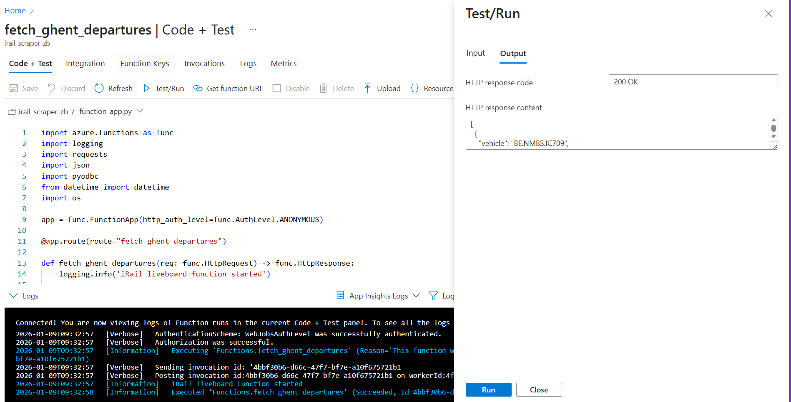
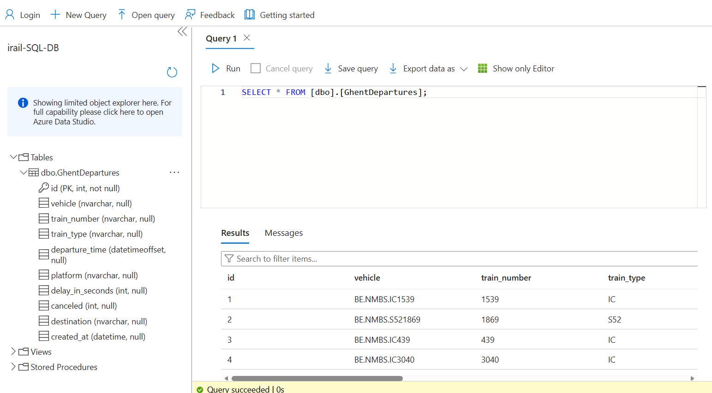

# iRail Data Engineering Pipeline - Ghent Sint Pieters Station

[](https://www.python.org/)
[](https://forthebadge.com/generator)
<!-- [](https://forthebadge.com/generator) -->


[](https://www.luetze-transportation.com/blog/ai-in-the-railway-ecosystem)  
*Image source: [Luetze Transportation](https://www.luetze-transportation.com/blog/ai-in-the-railway-ecosystem)*

## Description
The Belgian railway network is a complex web of real-time movements, delays, and connections. This project focuses on building a robust, cloud-native data pipeline to capture this motion. By fetching live data from the [iRail API](https://docs.irail.be/), processing it through Azure Functions, and storing it in an Azure SQL Database, this project transforms raw transport streams into structured insights for delay monitoring and operational analysis.

## Installation

1. **Clone the project:**

```
    git clone https://github.com/butkutez/challenge-azure.git
    cd challenge-azure
```
2. **Create virtual environment (Windows)**
```
   python3.10 -m venv .venv
   .\.venv\Scripts\Activate.ps1
   ```

3. **Install dependencies**  
```
    pip install -r requirements.txt
```

4. **Run the Data Pipeline** 

To fetch live data from iRail and populate your database, run the following command in your terminal:

```
    func start
```
Once the host is running, open the provided **local URL** (check the terminal)  in your browser.

## Repo Structure

```
CHALLENGE-AZURE
├──assets
│   ├── Azure_Function_app_test.png
│   └── Azure_SQL_database.png
├── .funcignore                   
├── .gitignore
├── function_app.py
├── host.json        
├── README.md
├── requirements.txt
└── table_code.sql
```
***Note**: `local.settings.json` is excluded from this repo for security but is required for local execution.*

## Process & Methodology

```
┌─────────────┐      ┌──────────────────┐      ┌─────────────────┐
│  iRail API  │ ──►  │  Azure Function  │ ──►  │  Azure SQL DB   │
│ /liveboard  │      │     (Python)     │      │  GhentDepartures│
└─────────────┘      └──────────────────┘      └─────────────────┘
   Raw JSON              Cleansed Data             Stored Data
```
The development of this pipeline followed a structured approach to ensure data integrity and cloud compatibility.

I. **Data Source & Analysis**
I analyzed the iRail API structure, specifically the **liveboard** endpoint. Since the API returns deeply nested JSON, I identified the following key fields required for meaningful insights:

- ```vehicle & vehicleinfo```: For train identification and type.

- ```time```: Unix timestamp requiring conversion to SQL-friendly DATETIME.

- ```delay```: Integer values to track punctuality.

II. **Normalization Strategy**
Instead of importing a heavy library like Pandas, I opted for a lightweight manual normalization approach within the Azure Function.

- **Flattening**: I iterated through the departures list to extract nested values (like train_number from inside vehicleinfo).  
Code:  ```train.get("vehicleinfo", {}).get("number")```

- **Data Typing**: I ensured integers (delays/canceled status) and strings (destinations) were correctly typed before the SQL insertion.  
Code: ``` int(train.get("delay", 0))```, ```int(train.get("canceled", 0))``` and ```train.get("station")```

- **Transformation**: 
    - *Parsing*: I converted raw Unix timestamps (seconds since epoch) into Python datetime objects using ```datetime.fromtimestamp(ts)```.

    - *Serialization*: I then used ```dt.isoformat()``` to generate ISO 8601 strings. This is a critical step because while Python objects exist in memory, Azure SQL requires a standardized string format to correctly interpret and store data into DATETIME columns.

III. **Cloud Infrastructure Setup**  
The infrastructure was provisioned via the Azure Portal:
- **Azure SQL Database**: Created a serverless database and configured the Server-level Firewall to allow the Function App's IP address.

- **Function App**: Configured a Python 3.10 environment.

- **Security**: To avoid hardcoding credentials, I utilized Azure App Settings (Environment Variables) to store the SQL_AZURE_CONNECTION string.

IV. **Database Integration**  
I used the **pyodbc driver** to establish a connection. To optimize performance, I implemented ```cursor.executemany()```. This allows the function to send all train departures in a single batch to the database, reducing "chattiness" and improving execution speed.

## SQL Schema
To support the data being fetched, I created the following table in Azure SQL:

```sql
CREATE TABLE GhentDepartures (
    id INT IDENTITY(1,1) PRIMARY KEY,
    vehicle NVARCHAR(100),
    train_number NVARCHAR(50),
    train_type NVARCHAR(50),
    departure_time DATETIMEOFFSET,
    platform NVARCHAR(10),
    delay_in_seconds INT,
    canceled INT,
    destination NVARCHAR(255),
    created_at DATETIME DEFAULT GETDATE()
);
```

## **The Result:**  
By automating the pipeline from iRail API to Azure SQL, I transformed raw JSON into structured transit insights for Ghent-Sint-Pieters.

**Azure App Test**:  
Successful execution of the `fetch_ghent_departures` function, returning live vehicle data.



**Azure SQL Database**:  
The `irail-SQL-DB` showing the `GhentDepartures` table successfully populated with real-time train numbers, delay times and information about the train.




## **Future Improvements:**  
- *Timer Trigger*: Automate data collection every hour for historical trend analysis.

- *Live Power BI Dashboard*: Connect Power BI Service (online) directly to Azure SQL for real-time reporting: 

    - Develop visuals: Time-series line graphs (trains per hour) and reliability bar charts.

    - Publish the dashboard to the web for public commuter access.

- *Predictive Analytics*: Use historical data to predict delays based on weather or time of day.

## **Timeline**
This project was completed over 4 days.

## **Personal Situation**
This project was completed as part of the AI & Data Science Bootcamp at BeCode.org.

**Connect** with me on [LinkedIn](https://www.linkedin.com/in/zivile-butkute/).